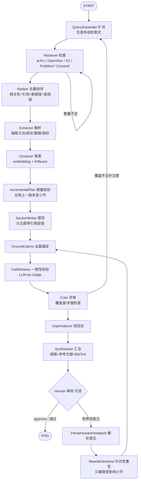

# lit-review-agent

> LangGraph agent that retrieves, clusters and synthesizes academic papers into cited literature reviews with gap analysis.

给定一个研究主题，自动完成：**扩词检索多源学术文献 → 去重排序 → 解析抽取 → 主题聚类 → 分主题撰写带引用段落 → 评审找空白 → 产出结构化综述（含参考文献表与 BibTeX）**。

核心不是「自由聊天」，而是 **检索召回质量 + 证据可追溯 + 结构化成稿**。

---

## 快速开始

```bash
# 1. 安装
python -m venv .venv && source .venv/bin/activate   # Windows: .venv\Scripts\activate
pip install -e .

# 2. 配置
cp .env.example .env      # 填入 DEEPSEEK_API_KEY 与 CONTACT_EMAIL

# 3. 先离线试跑，确认检索链路通
python -m src.main "retrieval augmented generation" --dry-run

# 4. 正式生成
python -m src.main "retrieval augmented generation"
```

产物默认写到 `output/`（Markdown 始终产出；`--format latex` / `--format docx` 再追加对应文件）：

| 文件 | 内容 |
|------|------|
| `*_review.md` | 综述正文（内联 `[n]` 引用 + 参考文献表 + 生成过程附录，含 A.6 证据锚定、A.7 一致性校验、A.8 引用网络分析、A.9 运行告警） |
| `*_references.bib` | BibTeX，可直接进 LaTeX |
| `*_review.tex` | 可编译 LaTeX 成稿（`--format latex`；`[n]` 转为 `\cite{key}`，配合同目录 `.bib`） |
| `*_review.docx` | Word 成稿（`--format docx`，需 `pip install -e ".[docx]"`） |
| `*_papers.json` | 完整文献池元数据（含得分、引用编号、引用网络中心度），便于人工复核 |
| `*_meta.json` | 成稿侧车（方向 B'）：本版各小节正文与主题簇，供下一版增量更新沿用编号与保留旧小节 |
| `*_citation_graph.json` | 引用网络侧车（方向 E'）：`{nodes, edges, gaps, stats}`，供 Web UI 交互式网络图渲染或单独复用 |
| `*_quality_report.json` | 质量评估侧车（方向 F'）：六维度得分、加权总分、等级、改进建议与亮点，供 Web UI 仪表盘渲染或 CI 质量门禁 |

### 示例输出

仓库自带一份用真实 DeepSeek 生成的中文综述样例（真实 LLM 跑通，84 篇引用与 BibTeX 完全对齐）：

- `output/deformable_mirror_review.md` —— 综述正文
- `output/deformable_mirror_references.bib` —— 参考文献 BibTeX
- `output/deformable_mirror_papers.json` —— 文献池元数据

> 复现：`python -m src.main "deformable mirror wavefront control" --provider deepseek`（需填 `DEEPSEEK_API_KEY`）。

---

## 工作流



**双环路**（都有硬性轮次上限，杜绝死循环）：

- **内环** `Retriever ⟲`：文献池未达 `TARGET_PAPER_COUNT` 时，放大每条检索式的返回上限重试，最多 `MAX_RETRIEVAL_ROUNDS` 轮。
- **外环** `Critic → QueryExpander`：评审判定覆盖不足时，带着**具体缺口**生成新检索式补文献——这是综述最容易漏掉关键流派的地方。最多打回 `MAX_CRITIC_ROUNDS` 次。

用 `python -m src.main --print-graph` 可打印实际编译出的状态机拓扑。

### 各节点职责

| 节点 | 职责 |
|------|------|
| `QueryExpander` | 主题 → 5-8 条英文检索式（同义词/方法名/数据集/评测/交叉领域）；打回时只生成补缺口的新检索式 |
| `Retriever` | 并发打多源 API（arXiv / OpenAlex / S2 / PubMed / Crossref，源间并行、源内串行以尊重限流），与已有池合并 |
| `Ranker` | 三级去重 → OpenAlex 补引用数 → 综合打分排序（含引用网络枢纽度信号，方向 D'）→ 对 Top-N 拉全文 |
| `Extractor` | 分批（5 篇/次）抽取「方法/结论/数据集/指标」，绑定 `paper_id`；各批并发（P3-4） |
| `Clusterer` | embedding + KMeans 分簇 → LLM 起小节标题 → 分配引用编号 |
| `IncrementalPlan` | 增量模式下对比本版与上一版主题簇，重叠≥50% 的小节沿用旧正文、其余标记重写，统计新增/重写/保留（方向 B'）；非增量模式直接放行 |
| `SectionWriter` | 每簇生成 300-600 字带 `[n]` 内联引用的段落；各簇并发（P3-4） |
| `Critic` | 检查覆盖度/矛盾处理/证据密度/结构，判 `pass` 或 `need_more` |
| `GapAnalyzer` | 结合年份分布与簇分布，识别研究空白与演进趋势 |
| `Synthesizer` | 摘要+引言+小节+空白+结论+参考文献+BibTeX，落盘；按 `OUTPUT_FORMAT` 额外产出 LaTeX / docx |
| `GroundClaims` | 把每小节核心论断拆成 `(text, paper_ids, confidence)`（P3-2）；各小节并发（P3-4） |
| `Faithfulness` | 引用-论断一致性校验（LLM-as-Judge）：逐条判断 claim 是否被其支撑论文真正支持，汇总得分与告警（方向 B）；受 `ENABLE_FAITHFULNESS` 开关 |
| `Human` | 可选挂起点：`approve` 直接定稿；带修改意见则进入针对性重写回环 |
| `ParseHumanFeedback` | 把人工意见解析成针对现有小节的 `rewrite` / `add` 动作（方向 A） |
| `RewriteSections` | 只重跑受影响小节（复用 `SectionWriter` + 人工意见），而非整篇重生成，受 `MAX_HUMAN_ROUNDS` 约束（方向 A） |

---

## 设计要点

### 1. 跨源去重与信息互补

同一篇论文常同时出现在 arXiv（有 PDF 直链，无引用数）和 OpenAlex（有引用数，可能无 PDF）。三级去重 **DOI → arXiv ID → 标题指纹**，命中后按「谁的信息更全用谁」合并字段，最终一条记录同时拥有 PDF 直链 + 被引量 + 完整摘要。

### 2. 排序信号与相关性闸门

排序用**相关性主导**的加权分（权重见 `.env` 的 `RELEVANCE_WEIGHT` 等）：

```
score = 0.55 × 相关性(TF-IDF 余弦)
      + 0.20 × 引用数(log 归一化)
      + 0.15 × 新颖度(年份归一化)
      + 0.10 × 检索式覆盖度(被几条检索式同时命中)
      + 0.10 × 引用网络枢纽度(PageRank，方向 D')
```

相关性占主导，是为了**不让高被引但跑题的论文绑架排序**（综述最常见的质量雷：像 Pascal VOC Challenge 这类被引近 2 万的跨主题论文混进候选池）。

**方向 D' 额外引入引用网络枢纽度（PageRank）作为第 5 路信号**（权重 `CITATION_HUB_WEIGHT`，默认 0.10）：枢纽度高的论文（被大量同池论文引用）权重提升，让必引文献更易进入候选，同时缓解「高被引但主题跑偏」的论文绑架排序；无引用数据时该项恒为 0，等价旧行为。详见下方「设计要点 9」。

**相关性闸门（P0-1）**：排序前先用 TF-IDF 余弦相似度算每篇与主题的相关性，低于 `RELEVANCE_GATE`（默认 0.10）的直接剔除出候选池，从源头阻止跑题文献进入聚类与撰写。闸门有自适应保底——若剔除过多导致文献池塌缩（< `MIN_POOL_AFTER_GATE`，默认 20），则按相关性降序保底保留前 N 篇。被剔除的论文标题记录在成稿附录 A.5，方便人工审计。

覆盖度这一项的作用：被多条不同角度检索式同时命中的论文，通常是该领域的枢纽工作。

### 3. 引用防幻觉

综述最致命的失败是编造引用。三道防线：

1. Prompt 里显式给出「可用引用编号」白名单，并声明不得使用列表外编号；
2. 生成后用 `_strip_invalid_citations()` 正则清洗，**物理删除**白名单外的 `[n]`；
3. 参考文献表只收录 `citation_map` 里的论文，编号严格连续。

测试 `test_full_graph_end_to_end` 会校验正文中每个 `[n]` 都能在参考文献表中找到。

### 4. 全文按需下载

不必全下 PDF：综述覆盖数十上百篇，真正需读全文的只是高相关那批（`TOP_N_FULLTEXT`，默认 8 篇），其余用摘要。全文会做 **头尾保留式压缩**（开头的摘要+引言+方法、结尾的实验结论），丢弃中间的公式推导，显著省 token。

全文抓取做了两处工程处理（P0-2）：

- **优先选 OA 可用文献**：从排序后的候选里优先挑「有 OA PDF 直链 / 可用 DOI 经 Unpaywall 解析」的论文下载，避免旧逻辑按总分取 Top-N 时总选中付费墙期刊论文（无 OA 副本），导致「全文解析 0 篇」；
- **诚实落盘**：`*_papers.json` 写入 `has_fulltext` 与 `fulltext_chars` 标记（不塞原始全文，避免文件膨胀），报告头据实声明「已获取 N 篇 OA 全文（其余基于摘要）」或「基于摘要撰写」。

### 5. 下载礼貌与版权合规

- arXiv 请求间隔 ≥ 3s；OpenAlex 带 `mailto` 进 polite pool；S2 无 key 时 3.2s/次；
- UA 统一为 `lit-review-agent/0.1 (mailto:你的邮箱)`，学术 API 靠这个识别善意机器人；
- 429 自动指数退避；单源失败不中断全局；
- **只下 OA / 作者自存档副本**，明确的出版社付费墙域名直接跳过；
- 每个落盘 PDF 附带 `.json` sidecar 记录来源 URL 与 license。

### 6. 零配置也能跑

- 聚类默认用 `sentence-transformers` 的语义向量（`all-MiniLM-L6-v2`，首次运行自动下载约 80MB）；未装该包时自动降级为 TF-IDF + TruncatedSVD（纯 sklearn，无需下载模型）；
- 未指定簇数 → 用轮廓系数在 `[2, 8]` 区间自动选 k；
- LLM 抽取失败 → 用摘要首段兜底，保证每篇文献都有可用证据；
- JSON 解析失败 → 剥离代码围栏 / 截取平衡括号 / 修复尾随逗号，再失败则换 prompt 重试一次。

### 7. 元数据清洗（P0-3）

- DOI 经正则校验，明显非法的（缺 `10.` 前缀、含空白、后缀为空）直接丢弃，避免畸形 DOI 写进 BibTeX；
- 检索层常把「arXiv 预印本」与正式期刊 DOI 并存，据 **DOI 前缀 → 期刊名** 映射（如 `10.1364/AO`→Applied Optics、`10.1109`→IEEE、`10.1038`→Nature）在输出时还原真实 venue，纠正「arXiv preprint 配 Optics Express DOI」类错位，同时把条目类型从 `misc` 升级为 `article`/`inproceedings`。

### 8. LLM 并发与检索缓存（P3-4）

- **LLM 并发**：`Extractor`（按 5 篇一批）、`SectionWriter`（按主题簇）、`GroundClaims`（按小节）里的 LLM 调用彼此独立，用线程池（`chat_json_many` / `chat_many`，并发度 `LLM_MAX_WORKERS`，默认 4）并行执行，端到端时延近似从「Σ 单条」降到「最慢单条」。stub 模式自动串行（无并发意义，且保证离线测试可预测）。
- **检索 HTTP 磁盘缓存**：所有学术 API 的 GET 响应（2xx）按 `url+params+source` 哈希落盘到 `.cache/http/`，命中且未过期（默认 7 天）时直接复用、跳过网络——跨运行省配额、断网可复现；失败响应（429/5xx）不缓存，过期自动回源。流式下载（PDF）不走缓存。

### 9. 引用网络分析（方向 D'）

高被引 ≠ 必引。综述最容易漏掉的是「主题内必引但被引不一定最高」的关键文献，以及「跨子领域枢纽」论文。方向 D' 用 OpenAlex 的 `referenced_works` 在**本地文献池**内构建有向引用图，算两类中心度（纯 Python 确定性算法，不依赖 networkx）：

- **枢纽度（PageRank）**：被大量同池论文引用的论文得分高，识别「必引候选」；
- **桥接度（betweenness）**：处于不同子领域引用路径上的论文得分高，识别「跨子领域枢纽」；
- 无引用数据（池内无 `referenced_works`）时两者全部置 0，安全降级，不报错。

枢纽度作为排序第 5 路信号（见「设计要点 2」）。此外，`GapAnalyzer` 用**共引**找空白：把共享 ≥2 篇参考文献的论文用并查集聚成子领域，未被现有主题簇覆盖者标为研究空白候选，与 LLM 识别的 gaps 合并去重。成稿**附录 A.8「引用网络分析」**列出枢纽度 Top / 桥接度 Top 与「被相关性闸门剔除的高枢纽论文」告警，让关键文献识别与可能的误删可复核。

### 10. 增量更新已有综述（方向 B'）

定期更新某主题综述时，没必要每次从零重跑。方向 B' 让 agent 接住上一版成稿做增量更新：

- **载入历史池 + 沿用编号**：从上一版成稿 `base_path` 的 `<stem>_papers.json` 还原文献池并入检索 seed，同时把上一版 `citation_index` 重建为 `citation_map` 并入本轮，**历史引用编号跨版本延续**，不会因重跑而漂移；
- **只新检索新文献**：仅拉取 `since_date` 之后（或 `INCREMENTAL_DEFAULT_DAYS` 默认回看窗口内）的论文，旧文献直接复用，省 LLM 与检索配额；
- **`IncrementalPlan` 节点**：把本版主题簇与上一版按论文重叠度匹配，重叠 ≥50% 的小节**沿用上一版正文**（跳过重新生成），其余标记重写，并统计 `新增 / 重写 / 保留`；
- **侧车与说明**：`Synthesizer` 写出 `<stem>_meta.json` 侧车（保存本版 `sections` + `clusters`）供下一版沿用；成稿头渲染「增量更新：新增 N 篇，重写 M 个小节，保留 K 个小节（沿用历史引用编号）」。

> 用法：`python -m src.main "topic" --incremental --since 2024-01-01 --base output/上次_review.md`。无 `base_path` 时安全降级为常规生成。

---

## 配置

全部配置见 `.env.example`。常用项：

| 变量 | 默认 | 说明 |
|------|------|------|
| `LLM_PROVIDER` | `deepseek` | `deepseek` / `openai` / `ollama` / `stub` |
| `CONTACT_EMAIL` | — | **建议填真实邮箱**，学术 API 据此给更高配额 |
| `ENABLED_SOURCES` | `arxiv,openalex` | 可选 `semantic_scholar` / `pubmed` / `crossref`，逗号分隔 |
| `TARGET_PAPER_COUNT` | `40` | 文献池目标规模，不足触发内环 |
| `TOP_N_FULLTEXT` | `8` | 下载全文的篇数，`0` 或 `ENABLE_FULLTEXT=false` 为纯摘要模式 |
| `N_CLUSTERS` | `0` | 主题簇数，`0` = 自动推断 |
| `MAX_CRITIC_ROUNDS` | `2` | 外环允许的打回次数 |
| `RELEVANCE_GATE` | `0.10` | 相关性闸门阈值，低于此分的论文剔除出候选池；`0` 关闭 |
| `MIN_POOL_AFTER_GATE` | `20` | 闸门保底：至少保留这么多篇，防止文献池塌缩 |
| `REPORT_LANGUAGE` | `zh` | `zh` / `en` |
| `OUTPUT_FORMAT` | `md` | 成稿格式：`md` / `latex` / `docx`（`docx` 需 `[docx]` extra） |
| `ENABLE_FAITHFULNESS` | `true` | 引用-论断一致性自动评测开关（方向 B），关闭可省 LLM 成本 |
| `MAX_HUMAN_ROUNDS` | `2` | 人工审核「针对性重写」回环的最大轮次（方向 A），防无限回环 |
| `CHECKPOINT_BACKEND` | `memory` | 检查点后端；`--human`/`--resume` 会自动强制 `sqlite`（需 `pip install -e ".[persist]"`，已包含在 `[all]`） |
| `LLM_MAX_WORKERS` | `4` | LLM 调用并发线程数（P3-4）：Extractor / SectionWriter / GroundClaims 的批量调用并行执行，缩短端到端时延 |
| `HTTP_CACHE_ENABLED` | `true` | 检索 GET 响应磁盘缓存开关（P3-4）：命中则跳过网络，省学术 API 配额 |
| `HTTP_CACHE_TTL_DAYS` | `7` | 缓存有效期（天）；过期自动回源重取 |
| `RUN_TIMEOUT_SECONDS` | `1800` | 长任务超时上限（秒）：超过则中断流式循环并产出「最佳努力成稿」；`0` 关闭看门狗 |
| `CITATION_HUB_WEIGHT` | `0.10` | 引用网络枢纽度（PageRank）在综合排序中的权重（方向 D'）；无引用数据时恒为 0 |
| `INCREMENTAL_DEFAULT_DAYS` | `180` | 增量更新未给 `--since` 时的默认回看窗口（天），仅增量模式生效（方向 B'） |

### 换 LLM

```bash
python -m src.main "topic" --provider openai        # 或 ollama
```

Ollama 走本地 OpenAI 兼容端点，无需 key，但不启用 JSON mode（靠容错解析兜底）。

---

## CLI

```
python -m src.main <主题> [选项]

检索：
  --sources arxiv,openalex,pubmed,crossref   启用的检索源
  -n, --target 40               文献池目标规模
  --per-query 25                单条检索式单源最大返回条数
  --min-year 2020               只保留该年份及之后的文献
  --top-fulltext 8              下载解析全文的 Top-N 篇数
  --no-fulltext                 纯摘要模式

生成：
  --provider deepseek|openai|ollama|stub
  --clusters 5                  主题簇数，0=自动
  --lang zh|en                  综述正文语言
  --critic-rounds 2             Critic 打回次数上限
  --format md|latex|docx        成稿格式（默认 md；latex 产出可编译 .tex，docx 产出 Word）
  --human                       定稿前挂起等待人工审核（自动启用 SQLite 检查点）
  --resume                      续跑被 --human 挂起的 thread（配合 --thread-id）
  --feedback "意见"             续跑时的人工审核意见（可省略，默认 approve）

增量更新（方向 B'）：
  --incremental                 增量模式：载入上一版成稿、沿用引用编号、只新检索新文献
  --since 2024-01-01            增量模式只检索该日期之后的文献（缺省用 INCREMENTAL_DEFAULT_DAYS 回看窗口）
  --base output/上次_review.md  上一版成稿路径（用于还原文献池与编号）；缺省则安全降级为常规生成

其他：
  -o, --output output/          输出目录
  --thread-id xxx               检查点线程 ID，同名可断点续跑
  --dry-run                     离线试跑：stub LLM + 不下载 PDF（仅验证流程）
  --print-graph                 打印状态机结构
  --run-timeout 1800            长任务超时上限（秒，0=关闭）；超时后产出最佳努力成稿
  --no-store                   不读写本地持久化文献池（跨主题复用失效，每次重新检索）
  --no-http-cache               禁用检索 HTTP 磁盘缓存，每次都重新打学术 API
  -v, --verbose                 DEBUG 日志
```

### 人工介入（断点续跑）

开启 `--human` 后，图会在 `human_review` 节点内调用 `interrupt()` 挂起并生成草稿，**进程退出也不丢失**（用 SQLite 检查点持久化）。审核后再用 `--resume --thread-id <同一ID>` 续跑定稿——这条路径在 `tests/test_graph.py` 的 `test_run_review_human_resume` 里有端到端覆盖。

```bash
# 第 1 步：生成草稿并挂起（--human 自动启用 SQLite 检查点）
python -m src.main "topic" --human --thread-id my-run

# 第 2 步：审阅 output/ 下的 *_review.md 后，同一 ID 续跑定稿
python -m src.main --resume --thread-id my-run
# 带上具体修改意见 → 触发「针对性重写」：只重跑受影响小节，再重新定稿并再次挂起
python -m src.main --resume --thread-id my-run --feedback "第 3 节请补对比实验"
```

> 说明：续跑用的是 `Command(resume=feedback)` 而非 `graph.invoke(None)`，这是 LangGraph 1.x 中从 `interrupt()` 挂起恢复的正确方式。带具体意见时，LangGraph 会经 `ParseHumanFeedback → RewriteSections` 只重写相关小节（而非整篇重来），随后回到 `human_review` 再次挂起，形成可迭代的审核闭环（受 `MAX_HUMAN_ROUNDS` 约束）。未装 `langgraph-checkpoint-sqlite` 时 `--human` 会直接报错并给出安装提示。

程序化使用：

```python
from src.agent.graph import build_graph, run_review
from src.agent.state import initial_state
from langgraph.types import Command

graph = build_graph(with_human=True)
config = {"configurable": {"thread_id": "run-1"}, "recursion_limit": 80}

# 首次运行：成稿并在 human_review 处挂起
graph.invoke(initial_state("your topic"), config)
# ... 检查 / 修改 state["sections"] ...
graph.update_state(config, {"sections": edited_sections})
# 续跑定稿
graph.invoke(Command(resume="approve"), config)
```

---

## HTTP 服务（FastAPI）

把综述能力包成 HTTP 服务（设计文档 §3：CLI / FastAPI 入口），便于嵌进其它系统或做 Web 前端。

```bash
pip install -e ".[api]"                       # 安装 fastapi / uvicorn / pydantic
uvicorn src.api:app --host 0.0.0.0 --port 8000
```

```bash
# 健康检查
curl http://localhost:8000/healthz

# 发起一次综述
curl -X POST http://localhost:8000/review \
     -H "Content-Type: application/json" \
     -d '{"topic": "diffusion models for image super-resolution",
          "sources": "arxiv,openalex,pubmed,crossref", "lang": "en"}'

# 增量更新：接住上一版成稿，只新检索新文献、沿用历史编号（方向 B'）
curl -X POST http://localhost:8000/review \
     -H "Content-Type: application/json" \
     -d '{"topic": "diffusion models for image super-resolution",
          "incremental": true, "since_date": "2024-01-01",
          "base_path": "output/上次_review.md", "lang": "en"}'
```

返回 `{topic, paper_count, citation_count, section_count, gaps, artifacts}`，`artifacts` 给出生成的 `md` / `bib` / `json` 绝对路径。API 模式默认 `with_human=False`；若 LLM 未配 key 返回 400，未生成成稿返回 422/500 并带原因。`ReviewRequest` 还支持 `incremental` / `since_date` / `base_path` 三个增量字段（方向 B'），以及 `with_human` / `thread_id` 两个 HITL 字段（方向 A'）：`with_human=True` 时成稿后挂起并推送 `interrupted` 事件（含草稿全文与 `thread_id`），由 `POST /review/resume` 回填意见续跑。`POST /review` 与 `POST /review/stream` 均接回上述字段。

### 流式 API + 自包含 Web UI（P3-3）

除了阻塞式的 `POST /review`，还提供 **SSE 流式接口** `POST /review/stream`，边生成边推送进度（每个节点一条 `progress` 事件，结束推 `done` / 出错推 `error`），适合前端实时展示。

```bash
# 浏览器打开自带的 Web UI（GET / 返回，无需任何前端构建）
open http://localhost:8000/

# 或命令行直接订阅 SSE
curl -N -X POST http://localhost:8000/review/stream \
     -H "Content-Type: application/json" \
     -d '{"topic": "diffusion models for image super-resolution", "lang": "en"}'
```

`GET /` 是一个**单文件 Web UI**：主题输入框 + 约束框 + 实时滚动的进度日志，纯原生 JS 直接 `fetch('/review/stream')` 读 SSE，不依赖任何前端框架；勾选「启用人工审核」后还会在成稿挂起时弹出**草稿审核面板**（预览草稿全文、文献/引用/小节统计、成稿文件路径，并可填写修改意见或一键定稿）；综述完成后还会渲染**引用网络面板**（交互式力导向图，见方向 E'）与**质量评估仪表盘**（六维度评分、总分与改进建议，见方向 F'）。把它嵌进现有系统或本地起服务试用都很方便。

返回结构（流式 `done` 事件与 `POST /review` 一致）：

```json
{
  "topic": "diffusion models ...",
  "paper_count": 40, "citation_count": 32, "section_count": 5,
  "gaps": ["..."],
  "artifacts": {"report": ".../review.md", "bibtex": ".../references.bib", "papers": ".../papers.json"}
}
```

### 人工审核（HITL）接入 Web UI（方向 A'）

把方向 A 的 CLI `--human` 续跑能力搬到浏览器：无需命令行即可「看草稿 → 提意见 → 多轮改稿 → 定稿」。

**流程**
1. 前端勾选「启用人工审核」后，`POST /review/stream` 带 `with_human=true` 发起；图在 `human_review` 处挂起（强制 SQLite 检查点），接口推送 `interrupted` 事件，载荷含 `thread_id`、`report`（草稿全文）与统计；
2. 前端展示草稿与意见输入框；用户点「提交修改意见并重生成」→ `POST /review/resume`（带 `thread_id` + `feedback`）以 `Command(resume=feedback)` 续跑，非空意见触发方向 A 的**针对性改写回环**并再次挂起；点「通过并定稿」→ 同一端点传空 `feedback` 直接定稿（`done`）；
3. 支持多轮迭代，最终 `done` 事件给出产物路径。

```bash
# 1) 发起并挂起（with_human=true）；interrupted 事件回传 thread_id 与草稿全文
curl -N -X POST http://localhost:8000/review/stream \
     -H "Content-Type: application/json" \
     -d '{"topic": "diffusion models for image super-resolution",
          "with_human": true, "lang": "en"}'

# 2) 回填意见续跑（非空 → 针对性改写后再次挂起；空 → 直接定稿）
curl -N -X POST http://localhost:8000/review/resume \
     -H "Content-Type: application/json" \
     -d '{"thread_id": "<上一步回传的 thread_id>",
          "feedback": "在第 1 个主题小节补充与对比方法的实验分析"}'
```

### 引用网络可视化（方向 E'）

把方向 D' 算出的枢纽度 / 桥接度 / 共引空白，从成稿附录 A.8 的静态文字升级为 Web UI 内嵌的**交互式力导向网络图**。综述完成后（`done` 事件自动回传 `citation_graph`），页面下方出现「🕸 引用网络」面板：

- **节点**：按主题簇着色，半径随**枢纽度（PageRank）**增大——一眼锁定必引候选；
- **边**：池内论文间的引用关系（有向，A→B 表示 A 引用 B）；
- **交互**：点击任意节点 → 高亮其邻居并弹详情框，列出其**池内引用 / 被引**论文标题、年份、被引数、枢纽度、桥接度；拖拽节点可调整布局；
- **筛选**：勾选「只显示枢纽论文（hub ≥ 0.3）」聚焦核心文献；
- **研究空白**：若方向 D' 的共引分析发现未被主题簇覆盖的子领域，在详情框顶部以「⚠ 研究空白候选」高亮提示。

图数据零外部依赖：纯原生 JS 手搓的力导向布局（斥力 + 弹簧 + 居中，rAF 收敛），随 `done` 事件内联回传，无需二次请求；同时落盘为 `<stem>_citation_graph.json` 侧车，可单独复用。

```bash
# 启动后浏览器打开 GET /，发起综述，完成后下拉到「引用网络」面板即可探索
open http://localhost:8000/
```

`/review/resume` 续跑前会预校验该 `thread_id` 确处于 `human_review` 挂起态，否则返回 400（避免误触发全新运行）。同一会话内的多轮改稿共用同一 `thread_id` 与 SQLite 检查点，进程重启也不丢失。

### 质量评估仪表盘（方向 F'）

把散落在各模块的「质量信号」聚合成一份**结构化质量报告**，综述完成后（`done` 事件自动回传 `quality_report`）页面下方出现「📊 质量评估仪表盘」面板，定稿前一眼定位薄弱点。复用方向 B（faithfulness）+ 方向 D'/E'（引用网络）+ P3-2（claim 锚定），零新依赖：

- **总分环**：加权总分（0-100）与等级 A/B/C/D，按分数着色；
- **六维度评分条**：
  1. **引用-论断一致性**——faithfulness 一致性得分（方向 B），低于 90% 即告警；
  2. **引用覆盖**——含 `[n]` 标注的小节占比，低于 80% 建议补引用；
  3. **引用网络枢纽度**——有引用边则满分，高枢纽论文被相关性闸门剔除则扣分（警告可能遗漏必引工作）；
  4. **主题覆盖均衡**——主题簇规模均衡度，存在研究空白时降分；
  5. **时效**——近 5 年文献占比，偏弱则建议补最新进展；
  6. **证据锚定强度**——claim 置信度 high/medium/low 加权（P3-2）。
- **⚠ 改进建议**：低于阈值的维度自动生成可操作建议（如「N 条论断疑似无充分支撑，建议补充引用」）；
- **✨ 亮点**：表现优异的维度（如一致性 ≥95%）正向提示。

报告同时落盘为 `<stem>_quality_report.json` 侧车，可独立复核或接入 CI 质量门禁。

### 长任务健壮性（方向 G'）

综述流水线跑得越久，越容易撞上三类长任务风险：**单节点偶发失败 / LLM 瞬时故障 / 运行过久**。方向 G' 让它在这些情况下**不白跑、不崩溃、可追溯**：

- **节点级错误隔离**：除定稿节点 `Synthesizer` 外的所有节点都被 `node_guard` 包裹。某节点抛异常时不再中断整条流水线，而是记一条结构化错误 `{节点, 错误, 类型, 时间}` 进 `run_errors`（跨节点累积），打人类可读降级日志，返回安全空更新让图继续，最终仍产出成稿。`Human-in-the-loop` 的 `interrupt()` 挂起信号被原样透传，绝不吞掉。
- **LLM 瞬时错误退避重试**：`chat()` 的重试判定从「仅 429」扩展为**429 限流 + 5xx 服务端错误 + 连接/超时/重置等网络瞬时故障**（按异常类型与文本兜底），指数退避重试；客户端 4xx（如 400/404）不重试；stub 模式无影响。
- **超时看门狗（最佳努力定稿）**：`run_review` 流式路径按 `RUN_TIMEOUT_SECONDS`（默认 1800s，`0`=关闭）设 `deadline`；每次产出 chunk 后检查，超时则中断循环并用已产出的 partial state 直接调 `Synthesizer` 产出**可用成稿**（置 `timed_out=True` 并记录 watchdog 错误）；即使定稿本身失败也退回极简占位成稿（仍记录错误）。
- **全链路运行告警**：所有降级/超时在四处显式呈现——
  - **成稿附录 A.9「运行告警」**：超时有独立橙色提示，节点级错误逐条列出「节点 · 时间 · 类型 · 错误」；
  - **Web UI**：`done` 事件携带 `errors` 与 `timed_out`，页面下方新增「⚠ 运行告警」面板（超时橙色卡片 + 节点错误红色卡片）；
  - **API**：`POST /review` 响应与 `done` 事件均含 `errors` / `timed_out`；
  - **CLI**：终态汇总打印超时提示与节点级错误（含节点名/类型/错误摘要），新增 `--run-timeout` 选项覆盖看门狗上限。

> 适用场景：`TARGET_PAPER_COUNT` 调很大、或主题很偏导致某源频繁报错/超时（如 PubMed 偶发 5xx、OpenAlex 限流）时，图不再颗粒无收，而是降级产出最佳努力成稿并把每处失败摆在台面上。

---

## 可观测（LangSmith）

设置以下环境变量即开启 LangSmith 轨迹上报（langgraph 在有 key 时自动记录每步 token / 工具调用 / 轨迹），无需改代码：

```bash
LANGSMITH_API_KEY=ls-...          # 必填，填了才开启追踪
LANGSMITH_PROJECT=lit-review-agent  # 可选，项目名
LANGSMITH_TRACING=true            # 可选，提供 key 时默认即开
```

`src/config.py` 的 `apply_langsmith_env()` 会在加载配置时把这些值透传为标准 `LANGCHAIN_*` 环境变量。

---

```
lit-review-agent/
├── src/
│   ├── agent/
│   │   ├── graph.py        # StateGraph 组装、条件路由、run_review 入口
│   │   ├── state.py        # AgentState / Paper / Evidence
│   │   ├── nodes.py        # 14 个节点实现（含 Faithfulness / ParseHumanFeedback / RewriteSections）
│   │   ├── tools.py        # 多源检索、去重、排序、全文获取
│   │   ├── prompts.py      # 各节点提示词
│   │   ├── llm.py          # 统一 LLM 调用 + JSON 容错 + 429/5xx/连接超时退避重试 + stub 后端
│   │   └── robust.py       # 长任务健壮性（方向 G'）：节点级错误隔离 node_guard
│   ├── ingest/
│   │   ├── base.py         # Paper 结构、限流器、礼貌 HTTP
│   │   ├── arxiv_client.py
│   │   ├── openalex.py     # 含摘要倒排索引还原、引用数补全
│   │   ├── semantic_scholar.py
│   │   ├── pubmed.py       # NCBI E-utilities：PubMed/PMC 检索 + PMC OA 全文
│   │   ├── crossref.py     # DOI 元数据 + 被引数（出版社页靠 Unpaywall 兜底）
│   │   ├── unpaywall.py    # 按 DOI 兜底找 OA
│   │   ├── downloader.py   # OA 解析 + PDF 下载 + license sidecar
│   │   └── pdf_parser.py   # pypdf 抽取 + 头尾压缩
│   ├── cluster/theme_cluster.py
│   ├── report/bibtex.py
│   ├── config.py
│   ├── main.py             # CLI 入口
│   └── api.py              # FastAPI 入口（可选依赖 [api]）
├── tests/                  # 139 离线测试，默认不联网（含 embedding 路径、HITL 续跑与改写回环、Web UI 接 HITL 反馈、PubMed/Crossref、HTTP 缓存、LLM 并发、faithfulness、多格式输出、引用网络分析、增量更新、引用网络可视化、质量评估仪表盘、长任务健壮性）
├── pyproject.toml
└── .env.example
```

---

## 测试

```bash
pip install -e ".[dev]"     # 含 embed / persist，便于本地跑全量
pytest -m "not network"     # 139 离线测试全过（端到端 stub 流程，含 HITL 续跑/改写回环、Web UI 接 HITL 反馈、faithfulness、多格式输出、引用网络分析、增量更新、引用网络可视化、质量评估仪表盘、长任务健壮性）
pytest -m network           # 联网测试，真打 arXiv / OpenAlex
```

离线测试用 stub LLM + 假检索覆盖了：标识符规范化、跨源去重合并、排序信号、相关性闸门与自适应保底、OpenAlex 摘要还原与 filter 转义、PDF 文本处理、全文 OA 优先获取、限流、**PubMed / Crossref 解析与接线**、聚类可分性与编号（含 embedding 分支）、BibTeX 条目类型与转义（含 arXiv 预印本+期刊 DOI 的 venue 纠错）、JSON 容错解析、引用防幻觉、两个环路的路由边界、端到端成稿结构与引用完整性、**Human-in-the-loop 挂起与 `Command(resume)` 续跑及针对性重写回环**、**引用编号跨轮次稳定**、**faithfulness 引用-论断一致性校验（含关闭分支）**、**LaTeX / docx 多格式成稿输出**、**LLM 429 退避重试**、**引用网络分析（PageRank 枢纽度 / betweenness 桥接度、共引空白、附录 A.8）**、**增量更新综述（载入历史池、沿用编号、保留未变小节、无 base 安全降级）**、**Web UI 接 HITL 反馈（`/review/stream` 挂起回传草稿、 `/review/resume` 回填意见续跑、多轮改稿定稿闭环）**、**引用网络可视化（Web UI 交互式力导向网络图、节点着色/大小语义、点击高亮邻居、研究空白高亮）**、**质量评估仪表盘（`compute_quality_report` 六维度得分、加权总分与等级、薄弱项改进建议与亮点、`done` 事件回传、Web UI 面板渲染）**、**长任务健壮性（节点级错误隔离 `node_guard`、LLM 瞬时错误重试分类、`run_errors` 跨节点累积、超时看门狗最佳努力成稿、`done` 事件回传 `errors`/`timed_out`、Web UI 运行告警面板、CLI 超时提示）**。

---

## 可选依赖

```bash
pip install -e ".[all]"      # embed + persist + dev + api，开箱即用（推荐）
# 或按需单独装：
pip install -e ".[embed]"     # sentence-transformers，语义聚类效果更好（默认已启用）
pip install -e ".[persist]"   # SQLite 检查点，断点续跑（--human 需要）
pip install -e ".[api]"       # FastAPI / uvicorn / pydantic，提供 HTTP 入口
pip install -e ".[docx]"       # python-docx，产出 Word (.docx) 成稿（--format docx）
pip install grandalf          # --print-graph 显示 ASCII 图
```

---

## 已知限制

- 中文主题也能跑，但检索式是英文的（学术 API 中文覆盖差），中文文献需另接 CNKI/万方类数据源；
- `Extractor` 默认只处理排序后前 60 篇，超大文献池需调 `MAX_EXTRACT_PAPERS`；
- **OpenAlex 用占位 `CONTACT_EMAIL`（`you@example.com`）会被 polite pool 限流（HTTP 429）**，检索返回空。务必填真实邮箱；
- 相关性闸门用 TF-IDF 余弦，阈值 0.10 对常见主题合适；若改用 embedding 相关性可酌情提高到 ~0.25（在 `RELEVANCE_GATE` 调整）。

> 已解决：引用编号在 Critic 外环打回重聚类后**保持稳定**（保留历史编号、仅追加新论文，见方向 A）；`Human-in-the-loop` 现已支持**针对性重写回环**（意见 → 只重跑受影响小节 → 重新定稿，见方向 A）；**引用网络分析（方向 D'）**与**增量更新已有综述（方向 B'）**亦已完成；**Web UI 已接 HITL 反馈（方向 A'）**——浏览器里看草稿、提意见、多轮改稿后一键定稿；**引用网络可视化（方向 E'）**——Web UI 内嵌交互式力导向网络图，点击枢纽论文看引用/被引、研究空白高亮；**质量评估仪表盘（方向 F'）**——把 faithfulness + 引用网络 + claim 锚定等信号聚合成六维度质量报告，Web UI 一键看总分与改进建议；**长任务健壮性（方向 G'）**——节点级错误隔离 + LLM 瞬时错误退避重试 + 超时看门狗最佳努力成稿，所有降级/超时在成稿附录 A.9、Web UI 运行告警面板、API 响应与 CLI 汇总里显式呈现。详见 `CHANGELOG.md`。

## 路线

- [x] MVP：arXiv + OpenAlex，摘要模式，扩词/聚类/成稿闭环
- [x] 全文 PDF 解析、Critic 外环、BibTeX、Human-in-the-loop
- [x] P0 质量改进：相关性闸门 + 混合排序、全文真正落地、元数据清洗
- [x] P1 能力补全：Human-in-the-loop 真正可续跑（SQLite 检查点 + `Command(resume)`）、embedding 聚类启用
- [x] P2 检索源扩展：PubMed/PMC + Crossref 检索器，默认白名单放行
- [x] P2 可靠性：LLM 客户端 429 指数退避重试
- [x] P2 服务化：FastAPI HTTP 入口（`src/api.py`）
- [x] P2 可观测：LangSmith 环境变量接线（有 key 自动开启轨迹）
- [x] P2 文档与示例：README Mermaid 图 + `output/deformable_mirror_*` 示例、真 LLM 测试脚手架（有 key 时运行）
- [x] P3-1 跨主题持久化文献池：SQLite 轻量存储（`src/ingest/store.py`），历史文献可召回/回填/复用，省检索配额（设计里的 chromadb/faiss 重方案降级为 SQLite，足够覆盖「跨主题复用」目标）
- [x] P3-2 Claim 级证据锚定：每个核心论断绑定支撑论文 + 证据强度（high/medium/low），写入成稿附录 A.6，可审计、可二次校验引用防幻觉
- [x] P3-3 流式 API + Web UI：`POST /review/stream` SSE 实时进度 + `GET /` 自包含单文件 Web UI（`src/api.py`）
- [x] P3-4 性能工程：LLM 批量并发（`chat_json_many`/`chat_many`，Extractor/SectionWriter/GroundClaims 并行）+ 检索 HTTP 磁盘缓存（`.cache/http/`，省配额、断网可复现）
- [x] **方向 A：Human-in-the-loop 闭环重生成 + 引用编号跨轮次稳定**（意见 → targeted rewrite 只重跑受影响小节；Critic 打回后编号不变）
- [x] **方向 B：引用-论断一致性自动评测（faithfulness，LLM-as-Judge）**（成稿附录 A.7 渲染得分与告警，受 `ENABLE_FAITHFULNESS` 开关）
- [x] **方向 C：多格式成稿输出**（LaTeX `.tex` 可编译 + Word `.docx`，`--format` / `OUTPUT_FORMAT` 切换）
- [x] **方向 D'：引用网络分析**（PageRank 枢纽度 / betweenness 桥接度识别必引与跨子领域枢纽；共引找空白；排序加枢纽度信号；附录 A.8）
- [x] **方向 B'：增量更新已有综述**（载入历史池 + 沿用编号 + 保留未变小节 + 增量说明；CLI `--incremental/--since/--base`，API 同名字段）
- [x] **方向 A'：Web UI 接 HITL 反馈**（浏览器看草稿、提意见、多轮改稿后定稿；`/review/stream` 带 `with_human` 推送 `interrupted` 含草稿全文，`/review/resume` 回填意见续跑，强制 SQLite 检查点）
- [x] **方向 E'：引用网络可视化**（Web UI 内嵌交互式力导向网络图：节点按簇着色/按枢纽度定大小，点击高亮邻居与引用-被引列表，研究空白高亮；`citation_graph.json` 侧车；纯原生 JS 无 CDN 依赖）
- [x] **方向 F'：质量评估仪表盘**（聚合 faithfulness + 引用网络枢纽度 + claim 锚定等信号成六维度质量报告，Web UI 渲染总分环/评分条/改进建议，`quality_report.json` 侧车，纯函数零依赖）
- [x] **方向 G'：长任务健壮性**（节点级错误隔离 `node_guard` + LLM 瞬时错误 429/5xx/连接超时退避重试 + 超时看门狗最佳努力成稿；`run_errors`/`timed_out` 在成稿附录 A.9、Web UI 运行告警面板、API 响应与 CLI 汇总里显式呈现）
- [ ] `unstructured` 解析器（当前 pypdf 已满足 PDF 抽取，单列）
