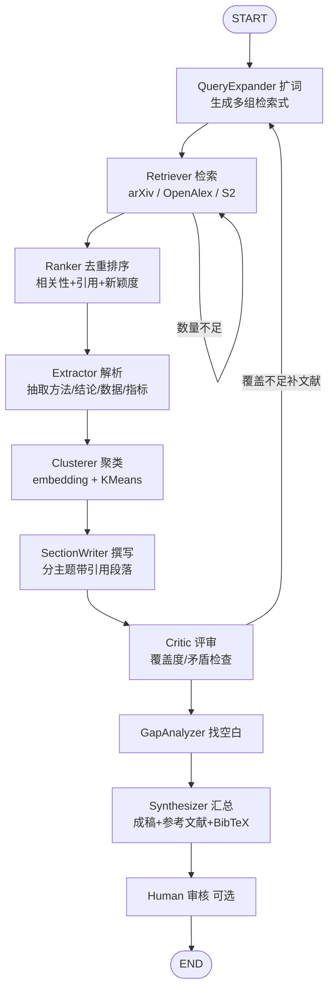

# lit-review-agent

> LangGraph agent that retrieves, clusters and synthesizes academic papers into cited literature reviews with gap analysis.

给定一个研究主题，自动完成：**扩词检索多源学术文献 → 去重排序 → 解析抽取 → 主题聚类 → 分主题撰写带引用段落 → 评审找空白 → 产出结构化综述（含参考文献表与 BibTeX）**。

核心不是「自由聊天」，而是 **检索召回质量 + 证据可追溯 + 结构化成稿**。

---

## 快速开始

```bash
# 1. 安装
python -m venv .venv && source .venv/bin/activate   # Windows: .venv\Scripts\activate
pip install -e .

# 2. 配置
cp .env.example .env      # 填入 DEEPSEEK_API_KEY 与 CONTACT_EMAIL

# 3. 先离线试跑，确认检索链路通
python -m src.main "retrieval augmented generation" --dry-run

# 4. 正式生成
python -m src.main "retrieval augmented generation"
```

产物默认写到 `output/`：

| 文件 | 内容 |
|------|------|
| `*_review.md` | 综述正文（内联 `[n]` 引用 + 参考文献表 + 生成过程附录） |
| `*_references.bib` | BibTeX，可直接进 LaTeX |
| `*_papers.json` | 完整文献池元数据（含得分、引用编号），便于人工复核 |

### 示例输出

仓库自带一份用真实 DeepSeek 生成的中文综述样例（真实 LLM 跑通，84 篇引用与 BibTeX 完全对齐）：

- `output/deformable_mirror_review.md` —— 综述正文
- `output/deformable_mirror_references.bib` —— 参考文献 BibTeX
- `output/deformable_mirror_papers.json` —— 文献池元数据

> 复现：`python -m src.main "deformable mirror wavefront control" --provider deepseek`（需填 `DEEPSEEK_API_KEY`）。

---

## 工作流



**双环路**（都有硬性轮次上限，杜绝死循环）：

- **内环** `Retriever ⟲`：文献池未达 `TARGET_PAPER_COUNT` 时，放大每条检索式的返回上限重试，最多 `MAX_RETRIEVAL_ROUNDS` 轮。
- **外环** `Critic → QueryExpander`：评审判定覆盖不足时，带着**具体缺口**生成新检索式补文献——这是综述最容易漏掉关键流派的地方。最多打回 `MAX_CRITIC_ROUNDS` 次。

用 `python -m src.main --print-graph` 可打印实际编译出的状态机拓扑。

### 各节点职责

| 节点 | 职责 |
|------|------|
| `QueryExpander` | 主题 → 5-8 条英文检索式（同义词/方法名/数据集/评测/交叉领域）；打回时只生成补缺口的新检索式 |
| `Retriever` | 并发打多源 API（arXiv / OpenAlex / S2 / PubMed / Crossref，源间并行、源内串行以尊重限流），与已有池合并 |
| `Ranker` | 三级去重 → OpenAlex 补引用数 → 综合打分排序 → 对 Top-N 拉全文 |
| `Extractor` | 分批（5 篇/次）抽取「方法/结论/数据集/指标」，绑定 `paper_id` |
| `Clusterer` | embedding + KMeans 分簇 → LLM 起小节标题 → 分配引用编号 |
| `SectionWriter` | 每簇生成 300-600 字带 `[n]` 内联引用的段落 |
| `Critic` | 检查覆盖度/矛盾处理/证据密度/结构，判 `pass` 或 `need_more` |
| `GapAnalyzer` | 结合年份分布与簇分布，识别研究空白与演进趋势 |
| `Synthesizer` | 摘要+引言+小节+空白+结论+参考文献+BibTeX，落盘 |
| `Human` | 可选挂起点，人工改完 state 再续跑 |

---

## 设计要点

### 1. 跨源去重与信息互补

同一篇论文常同时出现在 arXiv（有 PDF 直链，无引用数）和 OpenAlex（有引用数，可能无 PDF）。三级去重 **DOI → arXiv ID → 标题指纹**，命中后按「谁的信息更全用谁」合并字段，最终一条记录同时拥有 PDF 直链 + 被引量 + 完整摘要。

### 2. 排序信号与相关性闸门

排序用**相关性主导**的加权分（权重见 `.env` 的 `RELEVANCE_WEIGHT` 等）：

```
score = 0.55 × 相关性(TF-IDF 余弦)
      + 0.20 × 引用数(log 归一化)
      + 0.15 × 新颖度(年份归一化)
      + 0.10 × 检索式覆盖度(被几条检索式同时命中)
```

相关性占主导，是为了**不让高被引但跑题的论文绑架排序**（综述最常见的质量雷：像 Pascal VOC Challenge 这类被引近 2 万的跨主题论文混进候选池）。

**相关性闸门（P0-1）**：排序前先用 TF-IDF 余弦相似度算每篇与主题的相关性，低于 `RELEVANCE_GATE`（默认 0.10）的直接剔除出候选池，从源头阻止跑题文献进入聚类与撰写。闸门有自适应保底——若剔除过多导致文献池塌缩（< `MIN_POOL_AFTER_GATE`，默认 20），则按相关性降序保底保留前 N 篇。被剔除的论文标题记录在成稿附录 A.5，方便人工审计。

覆盖度这一项的作用：被多条不同角度检索式同时命中的论文，通常是该领域的枢纽工作。

### 3. 引用防幻觉

综述最致命的失败是编造引用。三道防线：

1. Prompt 里显式给出「可用引用编号」白名单，并声明不得使用列表外编号；
2. 生成后用 `_strip_invalid_citations()` 正则清洗，**物理删除**白名单外的 `[n]`；
3. 参考文献表只收录 `citation_map` 里的论文，编号严格连续。

测试 `test_full_graph_end_to_end` 会校验正文中每个 `[n]` 都能在参考文献表中找到。

### 4. 全文按需下载

不必全下 PDF：综述覆盖数十上百篇，真正需读全文的只是高相关那批（`TOP_N_FULLTEXT`，默认 8 篇），其余用摘要。全文会做 **头尾保留式压缩**（开头的摘要+引言+方法、结尾的实验结论），丢弃中间的公式推导，显著省 token。

全文抓取做了两处工程处理（P0-2）：

- **优先选 OA 可用文献**：从排序后的候选里优先挑「有 OA PDF 直链 / 可用 DOI 经 Unpaywall 解析」的论文下载，避免旧逻辑按总分取 Top-N 时总选中付费墙期刊论文（无 OA 副本），导致「全文解析 0 篇」；
- **诚实落盘**：`*_papers.json` 写入 `has_fulltext` 与 `fulltext_chars` 标记（不塞原始全文，避免文件膨胀），报告头据实声明「已获取 N 篇 OA 全文（其余基于摘要）」或「基于摘要撰写」。

### 5. 下载礼貌与版权合规

- arXiv 请求间隔 ≥ 3s；OpenAlex 带 `mailto` 进 polite pool；S2 无 key 时 3.2s/次；
- UA 统一为 `lit-review-agent/0.1 (mailto:你的邮箱)`，学术 API 靠这个识别善意机器人；
- 429 自动指数退避；单源失败不中断全局；
- **只下 OA / 作者自存档副本**，明确的出版社付费墙域名直接跳过；
- 每个落盘 PDF 附带 `.json` sidecar 记录来源 URL 与 license。

### 6. 零配置也能跑

- 聚类默认用 `sentence-transformers` 的语义向量（`all-MiniLM-L6-v2`，首次运行自动下载约 80MB）；未装该包时自动降级为 TF-IDF + TruncatedSVD（纯 sklearn，无需下载模型）；
- 未指定簇数 → 用轮廓系数在 `[2, 8]` 区间自动选 k；
- LLM 抽取失败 → 用摘要首段兜底，保证每篇文献都有可用证据；
- JSON 解析失败 → 剥离代码围栏 / 截取平衡括号 / 修复尾随逗号，再失败则换 prompt 重试一次。

### 7. 元数据清洗（P0-3）

- DOI 经正则校验，明显非法的（缺 `10.` 前缀、含空白、后缀为空）直接丢弃，避免畸形 DOI 写进 BibTeX；
- 检索层常把「arXiv 预印本」与正式期刊 DOI 并存，据 **DOI 前缀 → 期刊名** 映射（如 `10.1364/AO`→Applied Optics、`10.1109`→IEEE、`10.1038`→Nature）在输出时还原真实 venue，纠正「arXiv preprint 配 Optics Express DOI」类错位，同时把条目类型从 `misc` 升级为 `article`/`inproceedings`。

---

## 配置

全部配置见 `.env.example`。常用项：

| 变量 | 默认 | 说明 |
|------|------|------|
| `LLM_PROVIDER` | `deepseek` | `deepseek` / `openai` / `ollama` / `stub` |
| `CONTACT_EMAIL` | — | **建议填真实邮箱**，学术 API 据此给更高配额 |
| `ENABLED_SOURCES` | `arxiv,openalex` | 可选 `semantic_scholar` / `pubmed` / `crossref`，逗号分隔 |
| `TARGET_PAPER_COUNT` | `40` | 文献池目标规模，不足触发内环 |
| `TOP_N_FULLTEXT` | `8` | 下载全文的篇数，`0` 或 `ENABLE_FULLTEXT=false` 为纯摘要模式 |
| `N_CLUSTERS` | `0` | 主题簇数，`0` = 自动推断 |
| `MAX_CRITIC_ROUNDS` | `2` | 外环允许的打回次数 |
| `RELEVANCE_GATE` | `0.10` | 相关性闸门阈值，低于此分的论文剔除出候选池；`0` 关闭 |
| `MIN_POOL_AFTER_GATE` | `20` | 闸门保底：至少保留这么多篇，防止文献池塌缩 |
| `REPORT_LANGUAGE` | `zh` | `zh` / `en` |
| `CHECKPOINT_BACKEND` | `memory` | 检查点后端；`--human`/`--resume` 会自动强制 `sqlite`（需 `pip install -e ".[persist]"`，已包含在 `[all]`） |

### 换 LLM

```bash
python -m src.main "topic" --provider openai        # 或 ollama
```

Ollama 走本地 OpenAI 兼容端点，无需 key，但不启用 JSON mode（靠容错解析兜底）。

---

## CLI

```
python -m src.main <主题> [选项]

检索：
  --sources arxiv,openalex,pubmed,crossref   启用的检索源
  -n, --target 40               文献池目标规模
  --per-query 25                单条检索式单源最大返回条数
  --min-year 2020               只保留该年份及之后的文献
  --top-fulltext 8              下载解析全文的 Top-N 篇数
  --no-fulltext                 纯摘要模式

生成：
  --provider deepseek|openai|ollama|stub
  --clusters 5                  主题簇数，0=自动
  --lang zh|en                  综述正文语言
  --critic-rounds 2             Critic 打回次数上限
  --human                       定稿前挂起等待人工审核（自动启用 SQLite 检查点）
  --resume                      续跑被 --human 挂起的 thread（配合 --thread-id）
  --feedback "意见"             续跑时的人工审核意见（可省略，默认 approve）

其他：
  -o, --output output/          输出目录
  --thread-id xxx               检查点线程 ID，同名可断点续跑
  --dry-run                     离线试跑：stub LLM + 不下载 PDF（仅验证流程）
  --print-graph                 打印状态机结构
  -v, --verbose                 DEBUG 日志
```

### 人工介入（断点续跑）

开启 `--human` 后，图会在 `human_review` 节点内调用 `interrupt()` 挂起并生成草稿，**进程退出也不丢失**（用 SQLite 检查点持久化）。审核后再用 `--resume --thread-id <同一ID>` 续跑定稿——这条路径在 `tests/test_graph.py` 的 `test_run_review_human_resume` 里有端到端覆盖。

```bash
# 第 1 步：生成草稿并挂起（--human 自动启用 SQLite 检查点）
python -m src.main "topic" --human --thread-id my-run

# 第 2 步：审阅 output/ 下的 *_review.md 后，同一 ID 续跑定稿
python -m src.main --resume --thread-id my-run
# 也可带上审核意见（写入日志留痕，当前版本不自动重生成）
python -m src.main --resume --thread-id my-run --feedback "第 3 节请补对比实验"
```

> 说明：续跑用的是 `Command(resume=feedback)` 而非 `graph.invoke(None)`，这是 LangGraph 1.x 中从 `interrupt()` 挂起恢复的正确方式。未装 `langgraph-checkpoint-sqlite` 时 `--human` 会直接报错并给出安装提示。

程序化使用：

```python
from src.agent.graph import build_graph, run_review
from src.agent.state import initial_state
from langgraph.types import Command

graph = build_graph(with_human=True)
config = {"configurable": {"thread_id": "run-1"}, "recursion_limit": 80}

# 首次运行：成稿并在 human_review 处挂起
graph.invoke(initial_state("your topic"), config)
# ... 检查 / 修改 state["sections"] ...
graph.update_state(config, {"sections": edited_sections})
# 续跑定稿
graph.invoke(Command(resume="approve"), config)
```

---

## HTTP 服务（FastAPI）

把综述能力包成 HTTP 服务（设计文档 §3：CLI / FastAPI 入口），便于嵌进其它系统或做 Web 前端。

```bash
pip install -e ".[api]"                       # 安装 fastapi / uvicorn / pydantic
uvicorn src.api:app --host 0.0.0.0 --port 8000
```

```bash
# 健康检查
curl http://localhost:8000/healthz

# 发起一次综述
curl -X POST http://localhost:8000/review \
     -H "Content-Type: application/json" \
     -d '{"topic": "diffusion models for image super-resolution",
          "sources": "arxiv,openalex,pubmed,crossref", "lang": "en"}'
```

返回 `{topic, paper_count, citation_count, section_count, gaps, artifacts}`，`artifacts` 给出生成的 `md` / `bib` / `json` 绝对路径。API 模式默认 `with_human=False`；若 LLM 未配 key 返回 400，未生成成稿返回 422/500 并带原因。

---

## 可观测（LangSmith）

设置以下环境变量即开启 LangSmith 轨迹上报（langgraph 在有 key 时自动记录每步 token / 工具调用 / 轨迹），无需改代码：

```bash
LANGSMITH_API_KEY=ls-...          # 必填，填了才开启追踪
LANGSMITH_PROJECT=lit-review-agent  # 可选，项目名
LANGSMITH_TRACING=true            # 可选，提供 key 时默认即开
```

`src/config.py` 的 `apply_langsmith_env()` 会在加载配置时把这些值透传为标准 `LANGCHAIN_*` 环境变量。

---

```
lit-review-agent/
├── src/
│   ├── agent/
│   │   ├── graph.py        # StateGraph 组装、条件路由、run_review 入口
│   │   ├── state.py        # AgentState / Paper / Evidence
│   │   ├── nodes.py        # 10 个节点实现
│   │   ├── tools.py        # 多源检索、去重、排序、全文获取
│   │   ├── prompts.py      # 各节点提示词
│   │   └── llm.py          # 统一 LLM 调用 + JSON 容错 + 429 退避 + stub 后端
│   ├── ingest/
│   │   ├── base.py         # Paper 结构、限流器、礼貌 HTTP
│   │   ├── arxiv_client.py
│   │   ├── openalex.py     # 含摘要倒排索引还原、引用数补全
│   │   ├── semantic_scholar.py
│   │   ├── pubmed.py       # NCBI E-utilities：PubMed/PMC 检索 + PMC OA 全文
│   │   ├── crossref.py     # DOI 元数据 + 被引数（出版社页靠 Unpaywall 兜底）
│   │   ├── unpaywall.py    # 按 DOI 兜底找 OA
│   │   ├── downloader.py   # OA 解析 + PDF 下载 + license sidecar
│   │   └── pdf_parser.py   # pypdf 抽取 + 头尾压缩
│   ├── cluster/theme_cluster.py
│   ├── report/bibtex.py
│   ├── config.py
│   ├── main.py             # CLI 入口
│   └── api.py              # FastAPI 入口（可选依赖 [api]）
├── tests/                  # 66 个离线测试，默认不联网（含 embedding 路径、HITL 续跑、PubMed/Crossref）
├── pyproject.toml
└── .env.example
```

---

## 测试

```bash
pip install -e ".[dev]"     # 含 embed / persist，便于本地跑全量
pytest -m "not network"     # 66 个离线测试，约 5s
pytest -m network           # 联网测试，真打 arXiv / OpenAlex
```

离线测试用 stub LLM + 假检索覆盖了：标识符规范化、跨源去重合并、排序信号、相关性闸门与自适应保底、OpenAlex 摘要还原与 filter 转义、PDF 文本处理、全文 OA 优先获取、限流、**PubMed / Crossref 解析与接线**、聚类可分性与编号（含 embedding 分支）、BibTeX 条目类型与转义（含 arXiv 预印本+期刊 DOI 的 venue 纠错）、JSON 容错解析、引用防幻觉、两个环路的路由边界、端到端成稿结构与引用完整性、**Human-in-the-loop 挂起与 `Command(resume)` 续跑**、**LLM 429 退避重试**。

---

## 可选依赖

```bash
pip install -e ".[all]"      # embed + persist + dev + api，开箱即用（推荐）
# 或按需单独装：
pip install -e ".[embed]"     # sentence-transformers，语义聚类效果更好（默认已启用）
pip install -e ".[persist]"   # SQLite 检查点，断点续跑（--human 需要）
pip install -e ".[api]"       # FastAPI / uvicorn / pydantic，提供 HTTP 入口
pip install grandalf          # --print-graph 显示 ASCII 图
```

---

## 已知限制

- 中文主题也能跑，但检索式是英文的（学术 API 中文覆盖差），中文文献需另接 CNKI/万方类数据源；
- `Extractor` 默认只处理排序后前 60 篇，超大文献池需调 `MAX_EXTRACT_PAPERS`；
- 引用编号在 Critic 打回重跑后会重新分配，不保证跨轮次稳定；
- `Human-in-the-loop` 当前仅支持「审核意见留痕 + 定稿」，暂不支持「修改 state 后自动重生成小节」（重生成回环是后续增强）；
- **OpenAlex 用占位 `CONTACT_EMAIL`（`you@example.com`）会被 polite pool 限流（HTTP 429）**，检索返回空。务必填真实邮箱；
- 相关性闸门用 TF-IDF 余弦，阈值 0.10 对常见主题合适；若改用 embedding 相关性可酌情提高到 ~0.25（在 `RELEVANCE_GATE` 调整）。

## 路线

- [x] MVP：arXiv + OpenAlex，摘要模式，扩词/聚类/成稿闭环
- [x] 全文 PDF 解析、Critic 外环、BibTeX、Human-in-the-loop
- [x] P0 质量改进：相关性闸门 + 混合排序、全文真正落地、元数据清洗
- [x] P1 能力补全：Human-in-the-loop 真正可续跑（SQLite 检查点 + `Command(resume)`）、embedding 聚类启用
- [x] P2 检索源扩展：PubMed/PMC + Crossref 检索器，默认白名单放行
- [x] P2 可靠性：LLM 客户端 429 指数退避重试
- [x] P2 服务化：FastAPI HTTP 入口（`src/api.py`）
- [x] P2 可观测：LangSmith 环境变量接线（有 key 自动开启轨迹）
- [x] P2 文档与示例：README Mermaid 图 + `output/deformable_mirror_*` 示例、真 LLM 测试脚手架（有 key 时运行）
- [ ] 向量库持久化文献池（chromadb / faiss），跨主题复用（架构改动较大，单列）
- [ ] LaTeX 模板输出（设计列入，未实现）
- [ ] `unstructured` 解析器（当前 pypdf 已满足 PDF 抽取，单列）
