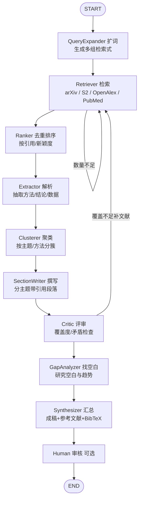

# 科研综述分析 Agent 设计方案 —— `lit-review-agent`

> 基于 LangChain + LangGraph 的自主文献综述智能体。本文整合了「agent 思路 / 形式 / 项目名 / 文献下载」四部分设计。

---

## 0. 一句话定位

给定研究主题，agent 自动完成：**扩词检索多源学术文献 → 去重排序 → 解析抽取 → 主题聚类 → 分主题撰写带引用段落 → 评审找空白 → 产出结构化综述（含参考文献表与 BibTeX）**。

核心卖点不是「自由聊天」，而是 **检索召回质量 + 证据可追溯 + 结构化成稿**。

---

## 1. 为什么用 LangGraph（而不是纯 LangChain 链）

| 能力 | LangGraph 价值 |
|------|---------------|
| 状态可持久 | `StateGraph` 把中间结果存在 `TypedDict`，配合 `langgraph-checkpoint`（内存/Redis/Postgres）断点可续、可复盘 |
| 循环与分支 | Plan-and-Execute 天然带「反思→重写 / 补文献」环路，用 `add_conditional_edges` 表达最自然 |
| 人类介入 | `interrupt_before` 可在关键节点挂起，等用户确认再继续 |
| 可观测 | 配合 LangSmith 看每步的 token / 工具调用 / 轨迹 |

---

## 2. 总体工作流（状态机）



**双环路**：
- 内环：`Retriever` ↔（数量不足）→ 再检索；
- 外环：`Critic` 发现「覆盖度不够 / 主题矛盾未解释」→ 打回 `Retriever` 补文献（综述最容易漏掉关键流派的地方）。

---

## 3. 项目结构（形式）

```
lit-review-agent/
├── src/
│   ├── agent/
│   │   ├── graph.py        # 组装 StateGraph、节点、边
│   │   ├── state.py        # papers / evidence / clusters / sections / gaps
│   │   ├── nodes.py        # planner/supervisor/researcher/writer/reflect
│   │   ├── tools.py        # 检索/下载/解析 工具
│   │   └── prompts.py      # 各节点提示词
│   ├── ingest/             # 文献下载层
│   │   ├── arxiv_client.py
│   │   ├── semantic_scholar.py
│   │   ├── openalex.py
│   │   ├── unpaywall.py
│   │   └── pdf_parser.py   # PyPDF / unstructured
│   ├── cluster/
│   │   └── theme_cluster.py  # embedding + 聚类分主题
│   ├── config.py           # 模型/检查点/API key
│   └── main.py             # CLI / FastAPI 入口
├── tests/
├── pyproject.toml
├── .env.example
└── README.md
```

---

## 4. 核心 State 设计

```python
from typing import Annotated, TypedDict, List
from langgraph.graph.message import add_messages

class Paper(TypedDict):
    paper_id: str
    title: str
    year: int
    citation_count: int
    abstract: str
    url: str
    pdf_url: str | None

class Evidence(TypedDict):
    paper_id: str
    claim: str        # 抽取出的结论/方法
    section: str      # 归属主题

class AgentState(TypedDict):
    messages: Annotated[list, add_messages]
    queries: List[str]              # 扩词结果
    papers: List[Paper]            # 去重后的文献池
    evidence: Annotated[List[Evidence], lambda a, b: a + b]
    clusters: dict                 # 主题 -> [paper_id]
    sections: dict                 # 主题 -> 综述段落(带引用)
    gaps: List[str]                # 研究空白
    report: str                    # 最终成稿(md/latex)
    iteration: int
```

---

## 5. 各节点职责

| 节点 | 职责 |
|------|------|
| `QueryExpander` | 把用户问题扩展成多组检索式（同义词、方法名、数据集名） |
| `Retriever` | 并发打多源学术 API，合并候选文献 |
| `Ranker` | 按 DOI/标题去重，按相关性 + 引用数 + 新颖度排序 |
| `Extractor` | 从摘要/全文抽取「方法、结论、数据集、指标」，绑定 `paper_id` |
| `Clusterer` | 用 embedding + KMeans 按主题/方法分簇 |
| `SectionWriter` | 每个主题生成带 `[1][2]` 内联引用的段落 |
| `Critic` | 检查覆盖度、是否解释对立结论，决定补文献还是放行 |
| `GapAnalyzer` | 识别研究空白、技术演进趋势 |
| `Synthesizer` | 汇总成稿 + 参考文献表 + BibTeX |
| `Human` | 可选人工审核后再定稿 |

---

## 6. 文献下载方案（ingest 层）

### 6.1 总体策略

```
主题 → 1. 元数据检索(标题/摘要/引用/DOI/OA链接) → 2. 去重+排序
     → 3. 全文下载: 仅对 Top-N 拉 PDF(其余用摘要) → 4. PDF 解析 → Extractor
```

> 不必全下 PDF：综述常覆盖数十上百篇，真正需读全文的只是高相关/高引用那批；摘要 + S2 abstract 已足够支撑大部分撰写。

### 6.2 数据源与下载方式

| 数据源 | 元数据/摘要 | 全文 PDF | 备注 |
|--------|------------|---------|------|
| **arXiv** | `export.arxiv.org/api/query` | `arxiv.org/pdf/{id}` 直链 | 无需 key，限流 3 秒/次 |
| **Semantic Scholar** | `api.semanticscholar.org/graph/v1/paper/search` | `openAccessPdf.url` 字段 | 带 `citationCount`，无 key 100/5min |
| **OpenAlex** | `api.openalex.org/works` | `open_access.oa_url` | 免 key、额度大，强烈推荐 |
| **PubMed / PMC** | `eutils.ncbi.nlm.nih.gov` | PMC OA：`ncbi.nlm.nih.gov/pmc/articles/PMCID/pdf/` | 需 `tool`+`email`，非 OA 仅摘要 |
| **Unpaywall** | 按 DOI 查 | 返回最佳 OA 副本 | 需邮箱，兜底用 |
| **Crossref** | DOI 元数据 | 多指向出版社页（付费） | 主要拿 DOI |

### 6.3 关键代码

**arXiv 元数据 + PDF 直链**

```python
import urllib.request, urllib.parse, xml.etree.ElementTree as ET

def search_arxiv(query, max_results=20):
    url = "http://export.arxiv.org/api/query?" + urllib.parse.urlencode({
        "search_query": f"all:{query}",
        "start": 0, "max_results": max_results, "sortBy": "relevance",
    })
    with urllib.request.urlopen(url, timeout=20) as r:
        root = ET.fromstring(r.read())
    ns = {"a": "http://www.w3.org/2005/Atom"}
    out = []
    for e in root.findall("a:entry", ns):
        aid = e.find("a:id", ns).text.split("/abs/")[-1]
        out.append({
            "paper_id": f"arxiv:{aid}",
            "title": e.find("a:title", ns).text.strip().replace("\n", " "),
            "year": int(e.find("a:published", ns).text[:4]),
            "abstract": e.find("a:summary", ns).text.strip(),
            "pdf_url": f"https://arxiv.org/pdf/{aid}",
        })
    return out
```

**OpenAlex（免 key，拿 OA 全文链接）**

```python
import urllib.request, json

def search_openalex(query, per_page=20):
    url = ("https://api.openalex.org/works?mailto=you@example.com&"
           + urllib.parse.urlencode({"search": query, "per-page": per_page,
               "select": "title,publication_year,cited_by_count,doi,open_access"}))
    with urllib.request.urlopen(url, timeout=20) as r:
        data = json.load(r)
    out = []
    for w in data["results"]:
        oa = w.get("open_access", {})
        out.append({
            "paper_id": w["doi"],
            "title": w["title"],
            "year": w.get("publication_year"),
            "citation_count": w.get("cited_by_count", 0),
            "pdf_url": oa.get("oa_url"),
        })
    return out
```

**统一 OA 解析器（按优先级选全文源）**

```python
def resolve_fulltext(paper):
    """返回可下载 PDF url，否则 None（退回摘要模式）"""
    if paper.get("pdf_url"):                 # arXiv / OpenAlex / S2 已给
        return paper["pdf_url"]
    if paper.get("doi"):                     # 兜底：Unpaywall 按 DOI 找 OA
        u = (f"https://api.unpaywall.org/v2/{paper['doi']}"
             f"?email=you@example.com")
        try:
            with urllib.request.urlopen(u, timeout=15) as r:
                best = json.load(r)["best_oa_location"]
                return best["pdf_url"] if best else None
        except Exception:
            return None
    return None
```

**下载 + 解析 PDF**

```python
import requests
from langchain_community.document_loaders import PyPDFLoader

def fetch_paper(paper, save_dir):
    pdf_url = resolve_fulltext(paper)
    if not pdf_url:
        return None  # 只有摘要，Extractor 直接用 abstract
    path = f"{save_dir}/{paper['paper_id'].replace('/', '_')}.pdf"
    headers = {"User-Agent": "lit-review-agent/0.1 (mailto:you@example.com)"}
    with requests.get(pdf_url, headers=headers, stream=True, timeout=30) as r:
        r.raise_for_status()
        with open(path, "wb") as f:
            for chunk in r.iter_content(8192):
                f.write(chunk)
    loader = PyPDFLoader(path)
    return "\n".join(p.page_content for p in loader.load())
```

### 6.4 下载礼貌（必须遵守）

- **arXiv**：两次请求间隔 ≥ 3 秒。
- **NCBI**：请求带 `tool=lit-review-agent&email=you@example.com`，无 key 限 3 次/秒。
- **Semantic Scholar**：加 `x-api-key` 头提配额；批量用 Bulk API。
- **OpenAlex**：URL 带 `mailto=` 进 polite pool，额度更高。
- **UA 必须带联系方式**：学术 API 靠 `mailto` 识别善意机器人。
- **版权**：只下 OA / 作者自存档副本，不抓出版社付费 PDF；落盘标注来源与 license。

---

## 7. 技术栈

- **编排**：`langgraph` `langchain`
- **模型接入**：`langchain-openai`（OpenAI）/ `langchain-community`（通义、Ollama 等本地模型）
- **检索**：`arxiv`、`semanticscholar`、OpenAlex（HTTP）、`pypdf` / `unstructured`
- **聚类/向量**：`scikit-learn`（KMeans）、`faiss-cpu` / `chromadb`
- **可观测**：LangSmith（可选）、`langgraph-checkpoint` 做状态持久化

---

## 8. GitHub 项目名建议

| 名称 | 说明 |
|------|------|
| **`lit-review-agent`** | 直白、与 `research-agent` 风格一致（推荐主名） |
| `surveyforge` | survey=学术综述，forge=锻造，好记 |
| `paperpilot` | 偏产品感 |
| `reviewgraph` | 强调 LangGraph |

仓库描述建议：
> *LangGraph agent that retrieves, clusters and synthesizes academic papers into cited literature reviews with gap analysis.*

---

## 9. 落地路线

1. **MVP**：arXiv 单源 + 摘要模式 + 扩词 + 聚类 + 成稿（最快跑通闭环）。
2. **进阶**：接入 Semantic Scholar / OpenAlex + 全文 PDF 解析 + embedding 聚类。
3. **高级**：`interrupt_before` 接 Human-in-the-loop、LangSmith 观测、向量库持久化文献池、输出 LaTeX/BibTeX。

---

## 10. 待确认（开工前告诉我）

1. **LLM 用哪家**：OpenAI / 通义 / 本地 Ollama？
2. **先接哪几个检索源**：arXiv（免 key）起步，还是要 S2 / OpenAlex / PubMed？
3. **输出格式**：Markdown 还是 LaTeX（学术论文向）？

> 确认后可直接在工作区生成可运行的 `lit-review-agent` 脚手架。
